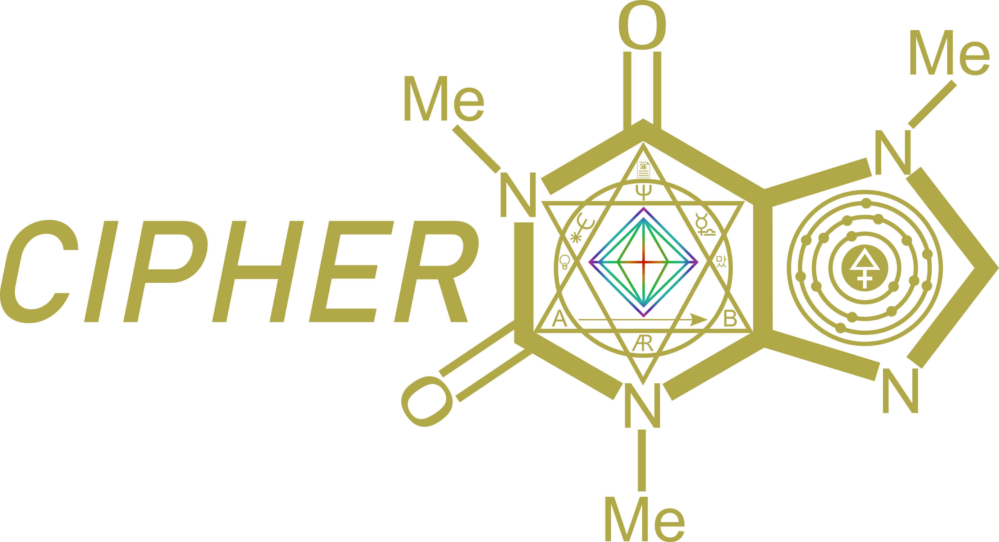

The **C**hemical **I**ndex for **P**roperties based on **H**ierarchical **E**xtendable **R**epresentation (CIPHER) is a binary encoding of chemical structures.  It is a superset of the [MMTF](http://mmtf.rcsb.org/) format and is designed to remain compatible with this format. CIPHER extensions include the ability to encode advanced graph structures, reactivity, and spectral information.
